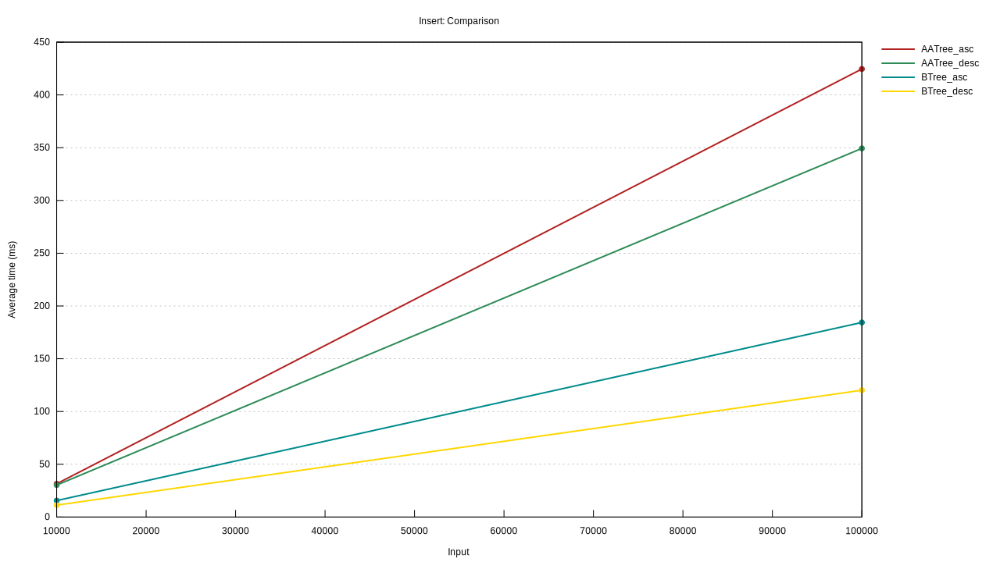
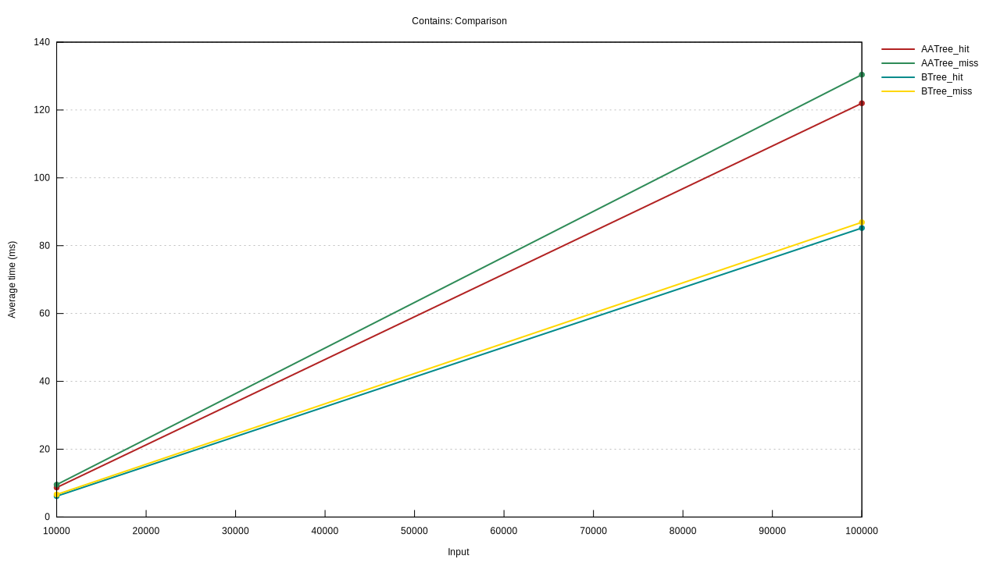

# AA Tree

[](https://drone.msrd0.eu/msrd0/aatree)
[](https://www.apache.org/licenses/LICENSE-2.0.html)
[](https://blog.rust-lang.org/2020/06/04/Rust-1.44.0.html)
[](https://matrix.to/#/#aatree:msrd0.de)

This crate implements an AA Tree in Rust. An AA Tree is basically a Red-Black Tree that disallows right children to be red. This results for less complexity in the implementation. For further details on the data structure, see https://en.wikipedia.org/wiki/AA_tree for more information on the data structure.

The standard library comes with a good set of data structures. See [`std::collections`] for a list of data structures and their (dis)advantages, however, not all advertised functionality of `BTreeMap` is actually implemented (at the time of writing). On average, this AA Tree implementation is about half as fast as the standard libraries `BTree` data structures.

## When to use `AATree` over `std::collections::BTree`

- Your application doesn't benefit from CPU caching but does from simpler implementations
- You want to find the largest or smallest key that is smaller or larger than something
- You need a BST that you can freely search with your own routine

## When to use `AATree` over `std::vec::Vec`

- You need a sorted data structure
- You need to efficiently check whether a key is contained or not
- You need a BST that you can freely search with your own routine

## Runtime Comparison

<div>
	
	
</div>

## Versioning

As all rust crates, this crate will follow semantic versioning guidelines. However, increasing the MSRV (minimum supported rust version) is not considered a breaking change.

## License

```
Licensed under the Apache License, Version 2.0 (the "License");
you may not use this file except in compliance with the License.
You may obtain a copy of the License at

    http://www.apache.org/licenses/LICENSE-2.0

Unless required by applicable law or agreed to in writing, software
distributed under the License is distributed on an "AS IS" BASIS,
WITHOUT WARRANTIES OR CONDITIONS OF ANY KIND, either express or implied.
See the License for the specific language governing permissions and
limitations under the License.
```

 [`std::collections`]: https://doc.rust-lang.org/stable/std/collections/index.html
